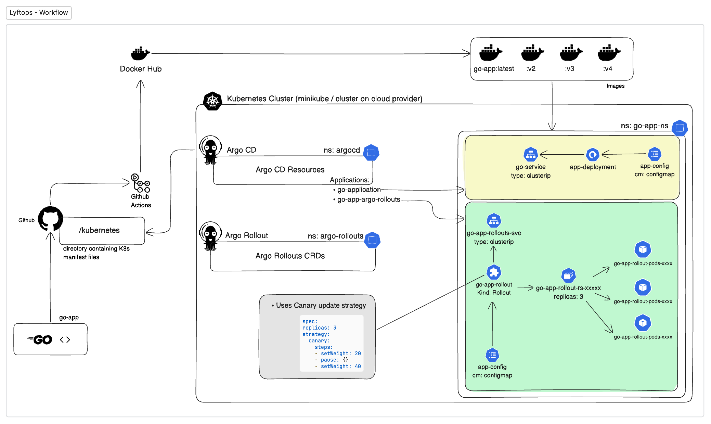

# LYFTOPS

The aim of this project is to understand the GitOps best practices, utilizing Argo CD for continuous deployment and Argo Rollouts for advanced deployment strategies within a Kubernetes environment. You will be responsible for setting up a GitOps pipeline that automates the deployment and management of a simple web application.

## Tech Stack

- `Kubernetes`
- `ArgoCD`
- `Argo Rollout`
- `Go`
- `Labstack - Echo`
- `Github Actions`
- `Docker`
- `Terraform`

## Application Workflow




Few things to note: 

> - `/kubernetes` contains the kubernetes manifest files for the Go application. It contains (Deployment, Service & ConfigMap)
> - `/kubernetes/argo-rollout` contains the Rollout for Go application. Plus Instruction to step Argo Rollout in Kubernetes cluster.
> There are 4 versions of docker image on docker hub. `go-app:latest`, `go-app:v2`, `go-app:v3`, `go-app:v4`.

- `Docker Image` is located at - https://hub.docker.com/r/siddhantprateek/go-app
---

- Currently, the application is written in Go which is in `/app` directory. 
- The Go application is containerized and pushed to Docker Hub to `siddhantprateek/go-app`.
- So everytime, I push any changes to Github,  a CI pipeline by Github Actions will be triggered which builds the docker image of the app and pushes it to Docker Hub.
- Within the Kubernetes cluster, there are 3 namespaces:
  - `go-app-ns`: contains all the resources related to Go app.
  - `argocd` : contains all the resources related to Argo CD.
  - `argo-rollout`: contains Argo Rollout CRDs.
- So in kubernetes cluster, ArgoCD creates a pipleline with Git repository, where any changes that occurred to manifest files in `/kubernetes` directory triggers the workflow.
- Argo CD continuously monitors the `/kubernetes` directory for changes.
- When changes are detected, Argo CD suggests that the application's current state is out of sync.
- Review the suggested changes in the Argo CD dashboard.
- Decide whether to proceed with syncing the changes, initiating a rollout of the updated application version, or rollback to a previous version.
- Argo CD facilitates the management of rollouts, ensuring seamless deployment of the updated application version.
- It provides visibility into the deployment process and allows for monitoring of the application's health and performance.

### Setting up the environment

- Make sure that Kubernetes environment in running. You can use Minikube or Kind or any kubernetes offering by any cloud provider.
- Spin your kubernetes  cluster (local or cloud).


## Infrastructure Configuration 

- If you want to Run Kubernetes on  Linode you need an API Token.

```bash
$ tofu plan
var.linode_token
  linode config token

  Enter a value: 

OpenTofu used the selected providers to generate the following execution plan. Resource actions are
indicated with the following symbols:
  + create

OpenTofu will perform the following actions:

  # linode_lke_cluster.linode_kube will be created
  + resource "linode_lke_cluster" "linode_kube" {
      + api_endpoints = (known after apply)
      + dashboard_url = (known after apply)
      + id            = (known after apply)
      + k8s_version   = "1.28"
      + kubeconfig    = (sensitive value)
      + label         = "linode_kube"
      + region        = "ap-south"
      + status        = (known after apply)
      + tags          = [
          + "prod",
        ]

      + pool {
          + count = 3
          + id    = (known after apply)
          + nodes = (known after apply)
          + type  = "g6-nanode-1"

          + autoscaler {
              + max = 5
              + min = 3
            }
        }
    }

Plan: 1 to add, 0 to change, 0 to destroy.
```
- To Spin up the Kubernetes  Cluster on Linode LKE, run

```bash
tofu apply # Create or update infrastructure
```
- To Access  your cluster via `kubectl`, go through /scripts, need to provide kubeconfig.yaml configuration.

- After forming the infrastructure

```bash
$ linode-cli lke clusters-list
┌────────┬─────────────┬────────┬─────────────┬─────────────────────────────────┐
│ id     │ label       │ region │ k8s_version │ control_plane.high_availability │
├────────┼─────────────┼────────┼─────────────┼─────────────────────────────────┤
│ 161755 │ linode-kube │ in-maa │ 1.28        │ False                           │
└────────┴─────────────┴────────┴─────────────┴─────────────────────────────────┘
```

- Setup Argo CD Resources
```bash
kubectl create namespace argocd 
kubectl apply -n argocd -f https://raw.githubusercontent.com/argoproj/argo-cd/stable/manifests/install.yaml
```
- Setup Argo Rollout

```bash
kubectl create namespace argo-rollouts
kubectl apply -n argo-rollouts -f https://github.com/argoproj/argo-rollouts/releases/latest/download/install.yaml
```
- Setup Application Resources

```bash
kubectl apply -f ./kubernetes/
kubectl apply -f ./kubernetes/argo-rollout/
```

- After all the things are setup you can play around with manifest file in `/kubernetes` directory by changing the image labels, through CLI.

```bash
 kubectl argo rollouts set image go-app-rollouts go-app-rollouts=siddhantprateek/go-app:<CHANGE_THE_LABEL> -n go-app-ns 
```


### Author

[Siddhant Prateek Mahanayak](https://github.com/siddhantprateek)